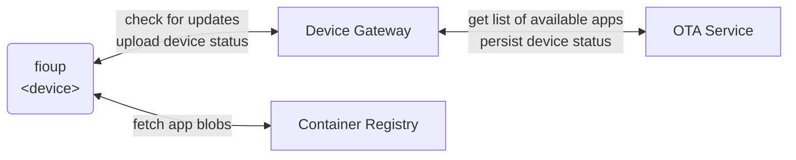

# fioup - FoundriesFactory OTA Update Client for Compose Apps

**fioup** is a command-line tool for performing over-the-air (OTA) updates of [Compose Apps](https://www.compose-spec.io/) published via the [FoundriesFactory™ platform](https://docs.foundries.io/latest).
It provides a simple and reliable way to deliver and manage Compose Apps updates on IoT, edge, and embedded devices.

## Prerequisites
`fioup` works only with Container-Only FoundriesFactories; therefore, it is assumed that the user has completed the following steps before using it.
1. [Signed up for the FoundriesFactory™ platform](https://docs.foundries.io/latest/getting-started/signup-container-only/index.html)
2. [Created a Container-Only factory](https://docs.foundries.io/latest/getting-started/signup-container-only/index.html#creating-your-factory)
3. [Built and published at least one Compose App](https://docs.foundries.io/latest/getting-started/building-deploying-app/index.html#gs-building-deploying-app)

## Getting Started

* [Installing fioup](./install.md)
* [Registering a device](./register-device.md)
* [Performing an update](./update-device.md)
* [Daemon mode](./daemon-mode.md)

## How It Works

The Compose Apps update performed by `fioup` conceptually works as illustrated in the following diagram.
Essentially, it is a continuation of [the Compose App creation and publishing flow](https://docs.foundries.io/latest/reference-manual/factory/container-only-architecture.html#app-creation-and-publishing-flow).

Specifically, `fioup` performs the following steps to accomplish Compose Apps update:
1. Registers itself with the FoundriesFactory (see [the device registration guide](./register-device.md) for details).
2. Communicates with the Device Gateway via mTLS to obtain a list of Targets — metadata about available versions of Compose Apps.
3. Fetches any missing blobs of the Compose Apps that the user wants to install and run on the device.
4. Stops the Compose Apps that are:
   1. being updated (new version of currently running App is listed in the Target being applied),
   2. removed from Target (App is removed from the Target being updated),
   3. disabled in the config (App is removed from the config, see [here](./register-device.md#changing-apps-that-run) for details).
5. Installs the Compose Apps. It includes unpacking the App archive/bundle containing `docker-compose.yml` along with its complement files and loading App container images to the docker engine storage.
6. Starts the Compose Apps that are:
   1. being updated (new version of currently running App is listed in the Target being applied),
   2. added to Target (App is added to the Target being updated),
   3. enabled in the config (App is added to the config, see [here](./register-device.md#changing-apps-that-run) for details).
7. Reports update status to the Device Gateway during the update process, and publishes the state of Compose Apps upon completion.
   This enables FoundriesFactory users to track device update stages and verify the post-update state of deployed Compose Apps.

## Useful references
1. [How to work with Compose App](https://docs.foundries.io/latest/tutorials/compose-app/compose-app.html) in a context of the FoundriesFactory™ platform.
2. [What Target is](https://docs.foundries.io/95/reference-manual/ota/targets.html).
